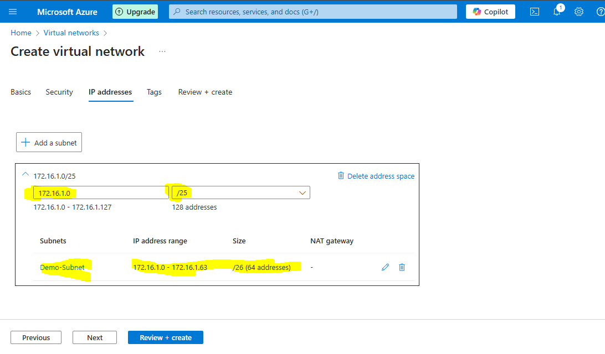
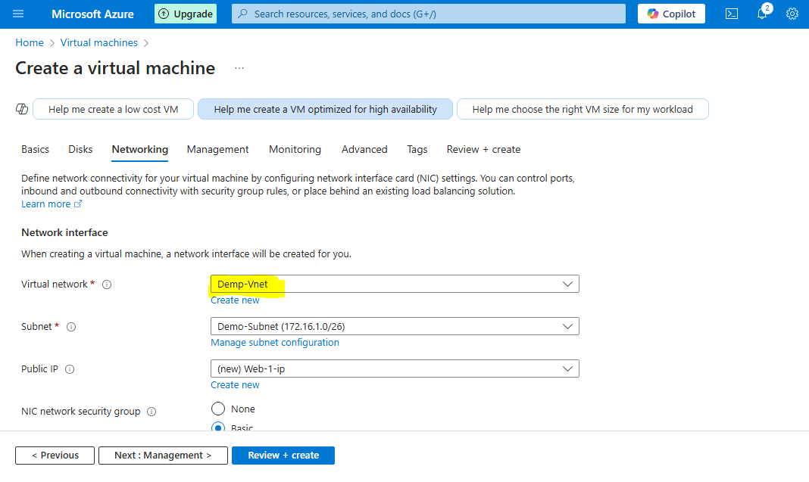
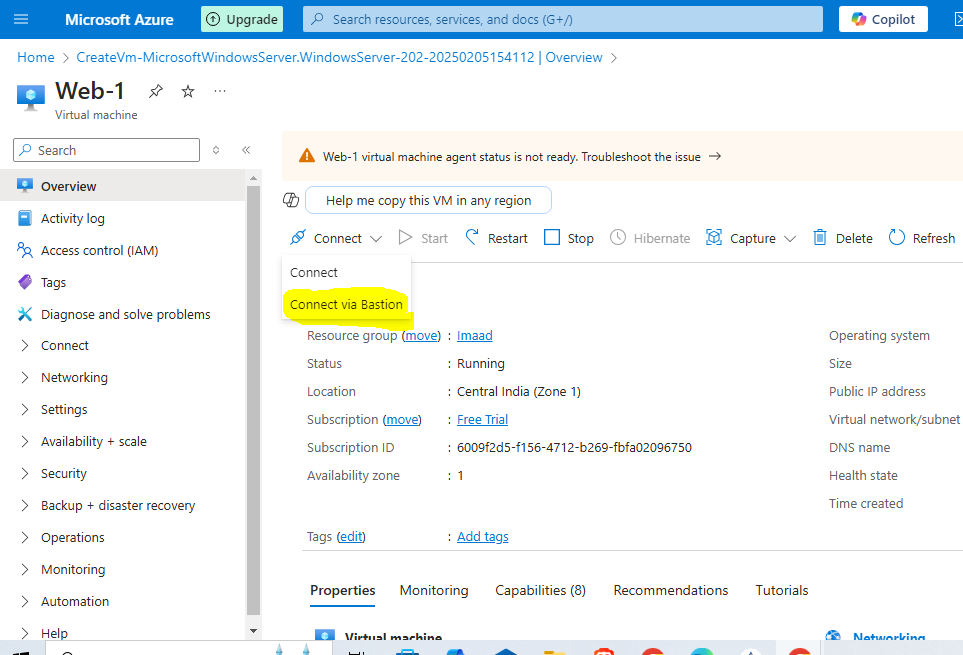
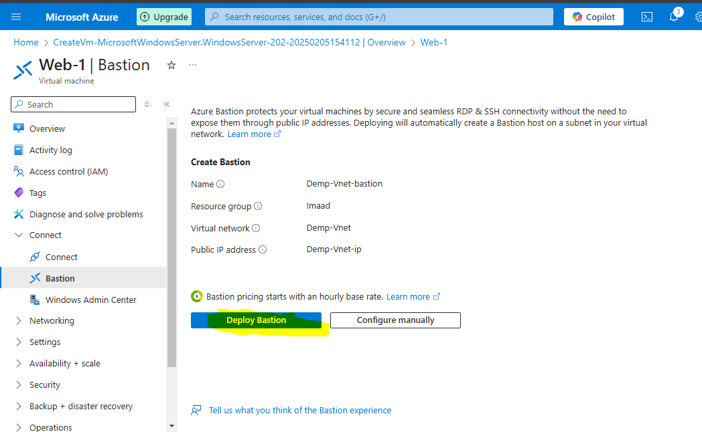
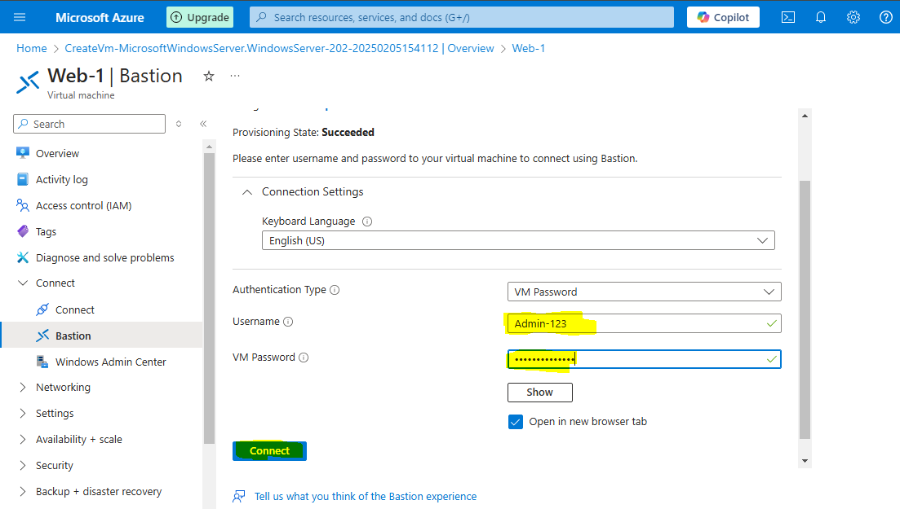
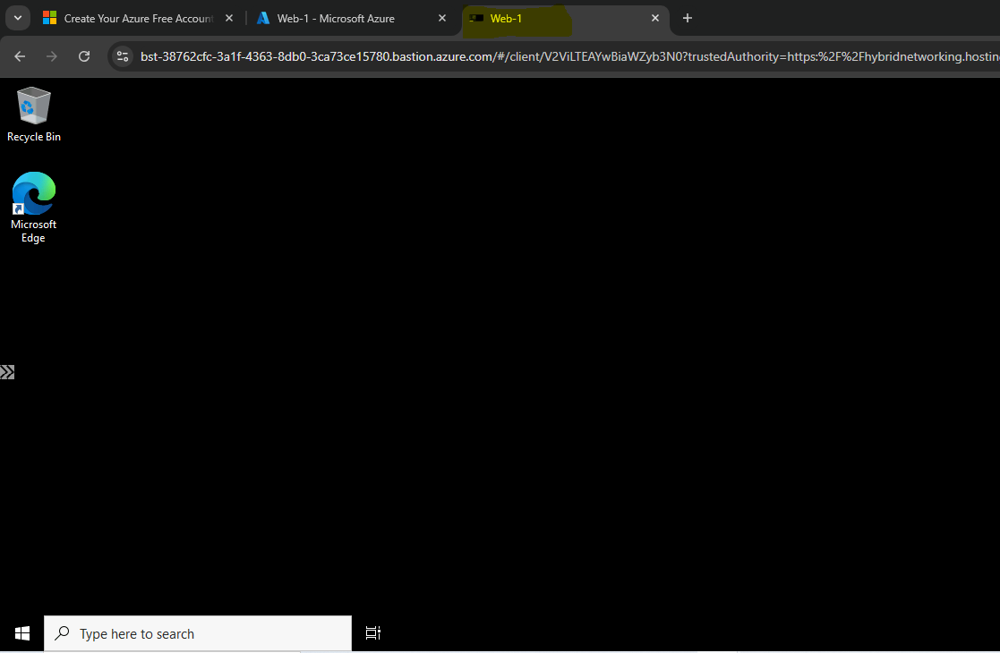

# Configure-Azure-Bastion

## What is Azure Bastion??

Azure Bastion – Secure VM Access Without RDP/SSH Exposure
Azure Bastion is a fully managed service that provides secure and seamless RDP and SSH access to your virtual machines without exposing them to the internet. Instead of using a public IP, Bastion allows you to connect to your VMs directly through the Azure portal over a private connection.

### Key Benefits:

✅ No Public IP Required – Eliminates the risk of exposing VMs to the internet.

✅ More Secure – Protects against brute-force attacks and port scanning.

✅ Seamless Access – Connect via the Azure portal without needing an RDP or SSH client.

✅ Fully Managed – No need to configure jump servers, VPNs, or additional firewall rules.

### How Azure Bastion Works

Deploy Azure Bastion inside your Virtual Network (VNet).

It creates a private, secure connection between the Azure portal and your VM.

Access your VM directly from the Azure portal using RDP or SSH, without requiring a public IP address.

### When to Use Azure Bastion?

When you need secure, browser-based access to VMs.

To eliminate exposure of RDP/SSH ports to the internet.

When you want simplified management without configuring VPNs or jump servers.

### Limitations

Only supports browser-based connections (No direct RDP/SSH client support).

Higher cost compared to using a public IP with NSG restrictions.

Cannot be used across VNets unless peered with an appropriate configuration.

### **Summary: Configuring Azure Bastion for Secure VM Access**  

In this project, I created a **Virtual Network (VNet)** with a **subnet**, reserving an additional subnet for **Azure Bastion**. After setting up a **Virtual Machine (VM) within the subnet**, I configured **Azure Bastion** to enable **secure, browser-based RDP/SSH access** without exposing the VM to the internet. This setup ensures a **secure, hassle-free** connection without the need for a public IP.

## Step - 1

i. Create a **Virtual Network (VNet)** and configure a **subnet** with a **/26 IP address range** to allocate **64 IP addresses**.

ii. Create a **Virtual Machine (VM)** and associate it with the **subnet** you created within the **Virtual Network (VNet)**.

## Step -2 

i. Once the **VM** is created, click on the **Connect** button, then select **Connect using Bastion**.

ii. Now, click on **Deploy Bastion** to set up the **Azure Bastion** service for secure VM access.

iii. Enter your **username** and **password**, then click on the **Connect** button to access the VM securely through **Azure Bastion**.

iv. Now, you will see that the **VM is successfully connected** using **Azure Bastion**, providing a **secure, browser-based RDP/SSH session** without exposing the VM to the internet. 🚀

